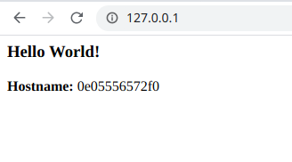

# Primeiros passos com Docker

Apesar do termo container ter se popularizado nos dias de hoje com a ferramenta Docker, o conceito já era empregado com utilizações de containers Linux e muitos casos de containers Java (JVM) principalmente para aplicações web, como utilizado nas plataformas JBoss e Wildfly.

## Surgimento

Originalmente o Docker surgiu em 2013 quando Solomon Hykes, fundador e CEO da dotCloud, realizou uma palestra na 'Python Developers Conference' em Santa Clara, California. Poucas semanas após isso rapidamente o projeto se tornou open source e através do Github teve contribuições de centenas de desenvolvedores que ajudaram a melhorar e disseminar a tecnologia que foi disruptiva para o mercado de TI mudando a forma de como as aplicações são disponibilizadas, dando praticidade, portabilidade e agilidade.

## Benefícios

Inicialmente é muito comum que o conceito do Docker seja confundido com o de máquinas virtuais devido à cultura e metodologia de trabalho utilizada durante anos, porém o Docker é muito mais que um provisionamento virtual e com proposta bem diferente. Enquanto uma máquina virtual é feita para perdurar durante um bom tempo, mesmo que a fluidez de provisionamento seja rápido e que se utilize de plataformas em cloud para criar e deletar máquinas, o container Docker já nasce com o propósito de ser substituível em um certo momento, em um novo deploy ou até mesmo em minutos após a execução de uma única tarefa.

Justamente essa volatilidade do container o faz eficaz, pois com o Docker você não precisa se preocupar com bibliotecas do sistema operacional, drivers, partições e etc, o Docker possui um repositório de imagens públicas em cloud, o DockerHub, em que é possível criar um container quase que instantaneamente através do comando “docker run” e dizendo qual imagem Docker este container deve utilizar para realizar o setup. 

Existem diversas imagens enxutas desde sistemas operacionais contento somente o mínimo necessário para uma aplicação ser executada, até imagens com serviços já instalados para serem utilizados como o caso da imagem “httpd:2.4” que traz um sistema operacional Linux Alpine com o serviço Apache HTTP instalado.

Este tipo de funcionalidade traz fluidez e agilidade para os processos de deploy, porém deve ser levado em consideração que aplicações que serão aplicadas em containers já devem ser estruturadas com o conceito “stateless”, que não guarda o estado da aplicação e nem dados dentro do container, pois caso contrário inviabilizaria uma das principais vantagens da utilização do Docker que é a versatilidade para de se encerrar o container em caso de problemas ou novas atualizações na aplicação.
 
## Exemplos de implantação

O primeiro passo para a utilização é realizarmos a instalação do Docker, para a demonstração serão utilizados exemplos para o sistema operacional Linux (Ubuntu/Debian).

### Pré-Requisitos:

Antes de iniciar a instalação certifique-se de ter permissão de super usuário, será necessário adicionar o repositório do Docker em seu sistema operacional para realizar o download do pacote, para isso execute a sequência de comandos a seguir:

1. Atualizando da lista de pacotes do repositório atual:

```shell
$ sudo apt-get update
```

2. Instalando pacotes para permitir o apt utilizar repositórios sobre HTTPS:

```shell
$ sudo apt-get install \
    apt-transport-https \
    ca-certificates \
    curl \
    gnupg-agent \
    software-properties-common
```

3. Instalando a chave criptográfica do repositório:

```shell
$ curl -fsSL https://download.docker.com/linux/ubuntu/gpg | sudo apt-key add -
```

4. Adicionando o repositório do Docker à lista de repositórios do sistema operacional:

```shell
sudo add-apt-repository \
   "deb [arch=amd64] https://download.docker.com/linux/ubuntu \
   $(lsb_release -cs) \
   stable"
```

### Instalação:

Agora sim poderemos iniciar a instalação do Docker, siga os passos:

1. Atualizando da lista de pacotes do repositório atual:

```shell
$ sudo apt-get update
```

2. Instalando a última versão do Docker e seus componentes:

```shell
$ sudo apt-get install docker-ce docker-ce-cli containerd.io
```

### Build da imagem:

Nesta etapa faremos o build de uma aplicação para gerar uma imagem de container que será executada posterirormente para simularmos um deploy. Para isso iremos utilizar um componente do chamado Dockerfile, um arquivo de configuração que irá nos auxiliar no build, contendo informações como imagem de referência, arquivos e serem copiados e pacotes adicionais para dependências da aplicação para a construção da imagem do container. Siga os passos abaixo:

1. Crie um diretório qualquer para utilizarmos na construção da imagem, após isso entre neste diretório como no exemplo:

```
mkdir docker-lab ; cd docker-lab
```

2. Agora vamos criar um arquivo com nome “Dockerfile” e inserir automaticamente o seu conteúdo, para isso digite na linha de comando o que está abaixo:

```
cat << EOF > Dockerfile
# Imagem de referência Python
FROM python:3.7-slim

# Selecionando o diretório do container para a execução dos comandos a seguir
WORKDIR /app

# Copiando o conteúdo do diretório que criamos para dentro do diretório do container
COPY . /app

# Instalando pacotes adicionais informados no arquivo requisitos.txt
RUN pip install --trusted-host pypi.python.org -r requisitos.txt

# Habilitando a porta 80 do container para receber conexões externas
EXPOSE 80

# Definindo variável de ambiente
ENV NAME World

# Executando aplicação Python após inicialização do container
CMD ["python", "app.py"]
EOF
```

3. Agora no mesmo diretório que estamos, crie um arquivo chamado “requisitos.txt” com o conteúdo Flask que será utilizado para informar os pacotes adicionais como no exemplo:

```
echo Flask > requisitos.txt
```
 
4. Criaremos agora o arquivo de nossa aplicação Python, assim continuando no mesmo diretório criaremos um arquivo com o nome de app.py e vamos inserir novamente ao mesmo tempo o seu conteúdo, assim digite na linha de comando o que está abaixo:

```
cat << EOF > app.py
from flask import Flask
import os
import socket

app = Flask(__name__)

@app.route("/")
def hello():
    html = "<h3>Hello {name}!</h3>" \
           "<b>Hostname:</b> {hostname}<br/>"
    return html.format(name=os.getenv("NAME", "world"), hostname=socket.gethostname())

if __name__ == "__main__":
    app.run(host='0.0.0.0', port=80)
EOF
```

> Atenção para a endentação do código!
    
5. Tudo pronto para realizarmos a construção de nossa imagem. No comando a seguir iremos utilizar o parâmetro “-t” ou “--tag” que servirá para identificarmos a nossa imagem com um nome, apelido ou até mesmo versão. Caso a versão de build não seja informada neste parâmetro o Docker assumirá por padrão que é a última (latest).  Ao final do comando também deveremos informar o contexto do Dockerfile, em nosso caso o mesmo diretório em que estamos trabalhando, representado no Linux pelo caracter “.”, veja:

```
sudo docker build --tag=testpy .
```

Para verificar as imagens criadas no Docker você pode executar o comando:

```
sudo docker image ls
```

### Deploy do container:

Agora veremos como iniciar a aplicação construída sendo executada dentro de um container Docker, através da imagem gerada no build:

1. Para iniciar um container Docker utilizaremos o comando abaixo com os parâmetros “-d” para o container ser executado em background, e também o “-p” que indicaremos qual porta de acesso de nosso computador irá direcionar as requisições para a porta que configuramos no container, e também será necessário informar o nome da imagem conforme a tag utilizada anteriormente:

```
docker run -d -p 80:80 testpy
```

Tente acessar no seu browser a url http://localhost/ você deverá visualizar algo parecido com a imagem abaixo:


 
2. Para finalizar o container em execução digite o comando abaixo adicionando no final o hostname que foi informado no browser. Esse hostname é o ID do container criado e também pode ser identificado usando o comando “docker container ls”:

```
docker container ls
docker rm -f “id”
```

## Além do básico

O que vimos até aqui foi somente a parte básica inicial do uso do Docker, seu potencial pode ser explorado ainda mais. Há outras formas de realizar o build e o deploy do container utilizando outros componentes do Docker como o “docker-compose” que permite você criar uma estrutura de provisionamento mais complexa, pois com ele é possível informar até quantas replicas deste mesmo container você irá querer executar de uma só vez entre outras coisas.
Outro módulo do Docker é o Swarm, responsável por criar, orquestrar e balancear todo o seu cluster de containers, garantindo alta disponibilidade e confiabilidade.

Também há outras tecnologias que podemos utilizar para complementar e falicitar o uso e execução de nossos containers, já é muito comum realizarmos o provisionamento e/ou consumirmos containers Docker como serviço em plataformas cloud. Há outras ferramentas que fornecem maior facilidade de gerenciamento e provisionamento do Docker como o Kubernets e até interface gráfica de monitoramento como o Openshift.

## Conclusão

Com este artigo podemos concluir que cada vez mais os profissionais e companhias estão buscando maior facilidade e agilidade para o provisionamento de ambientes e deploy de aplicações, as vezes até sem a necessidade de uma interação humana diminuindo a probabilidades de erros e a confiabilidade de execução, pois teremos a garantia de que dentro do container existirá somente o que é necessário e tudo o que é preciso para que a aplicação seja executada.


